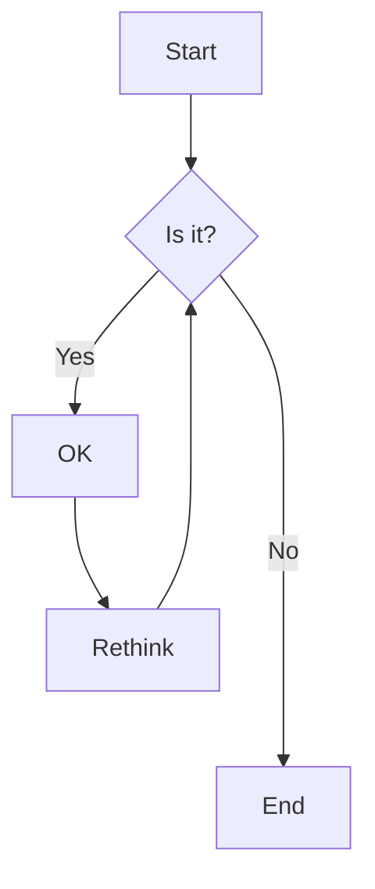

# test
测试测试

```
mermaid
graph TD;

给第三方插件唯一标识-->第三方插件获取文件处理数据-->根据唯一标识请求api获取数据

```


```mermaid
flowchart TD;
    A[Start] --> B{Is it?};
    B -- Yes --> C[OK];
    C --> D[Rethink];
    D --> B;
    B -- No ----> E[End];
```
