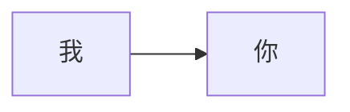
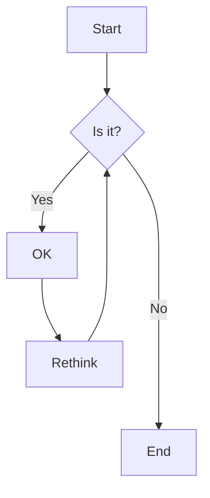

# test
测试测试

```mermaid
flowchart LR
        A["我"] -->B["你"]

```

```mermaid
flowchart TD;
    A[Start] --> B{Is it?};
    B -- Yes --> C[OK];
    C --> D[Rethink];
    D --> B;
    B -- No ----> E[End];
```
