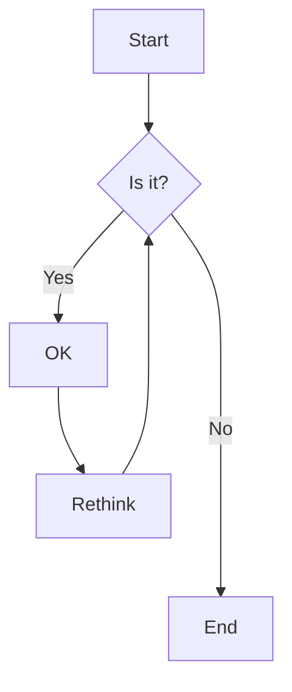

# test
测试测试

```mermaid
flowchart TB
    c1-->a2
    subgraph one
    a1-->a2
    end
    subgraph two
    b1-->b2
    end
    subgraph three
    c1-->c2
    end829;"

```

```mermaid
flowchart TD;
    A[Start] --> B{Is it?};
    B -- Yes --> C[OK];
    C --> D[Rethink];
    D --> B;
    B -- No ----> E[End];
```
